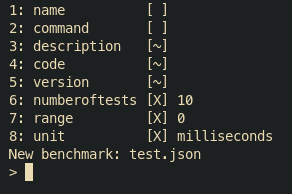

# BenchMaker

Benchmaker is a tool that helps you create benchmarks on everything that can be timed. You can then easily upload it to view and share it with others.

# Deploy 🎉🎉

- Fork this repo then copy the repo link
- Click on the button below and paste the link in the VUE_APP_GITHUB_URL env variable

# Link 🔗

https://benchmaker.vercel.app/

# Project 

What makes this project interesting is that there is no backend. The front use github to retrieve the benchmarks. So to upload a benchmark you just have to push it on this repo and it will be shown on the server.

The front is in vue.js with Material UI

# Create benchmarks 

To create a benchmark simply run: `benchmaker.py name_of_the_benchmark.json`.
You will be prompted something like this:

type a number between 1 to 8 press enter, then you can edit the corresponding field

`[ ]` Means it is required
`[~]` Means it's optional
`[X]` Means it is set but still editable

Once every required field is set you can type `run` to run the test and save the file. You can run mutliple benchmark in a single file. It is usefull in order to compare them easily on the web page. To run multiple benchmark in a single file just launch run multiple time in the benchmaker shell changing the fields for the corresponding benchmark each time.

You can type `help` to see the commands.

- run = run the current test
- ls = list tests in json file
- rm = remove a test
- stop = stop the program
- help = show the program\'s helper

The result of your benchmark is a json file. Push it on your forked github repo so that you can see it on the webpage.

## Limitations

The number of directories level inside benchmaker is limited to 3 

# Installation 📚

`npm install`

for development: `npm start`

for build: `npm build`

You can easily host this project yourself by replacing the repo link in the Home.vue file, might do an env variable for that in the future. Then you can host the front like myself on vercell or anything that hosts web pages.
